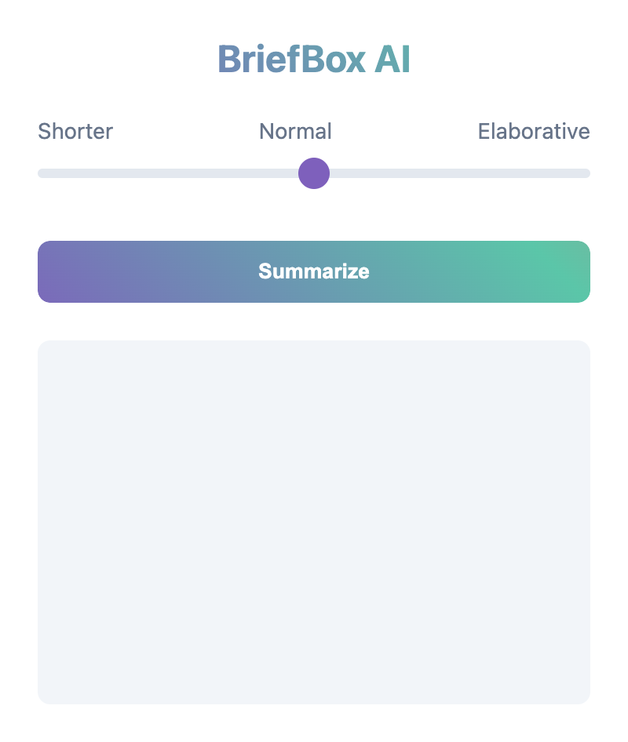
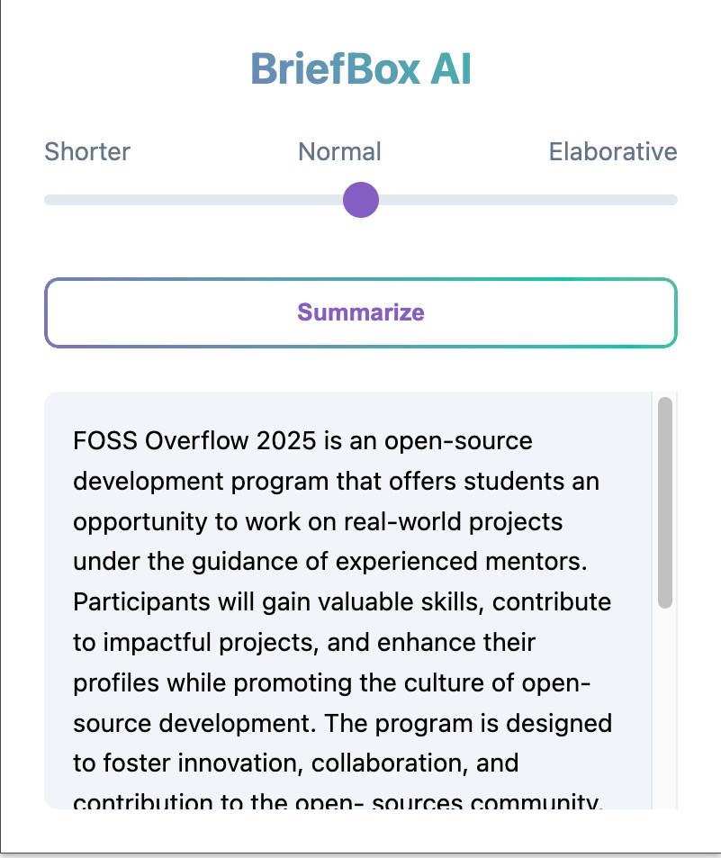
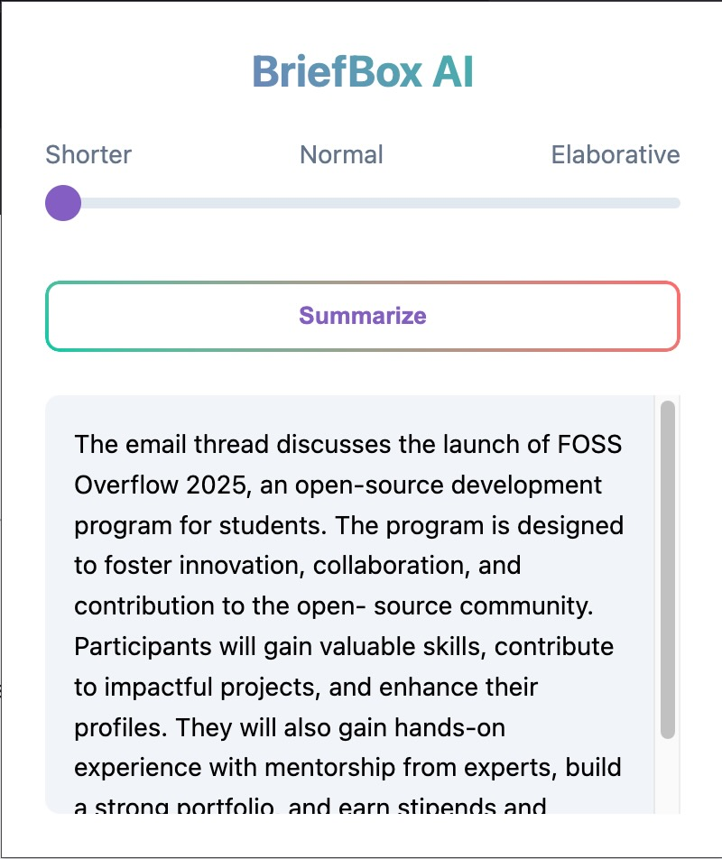
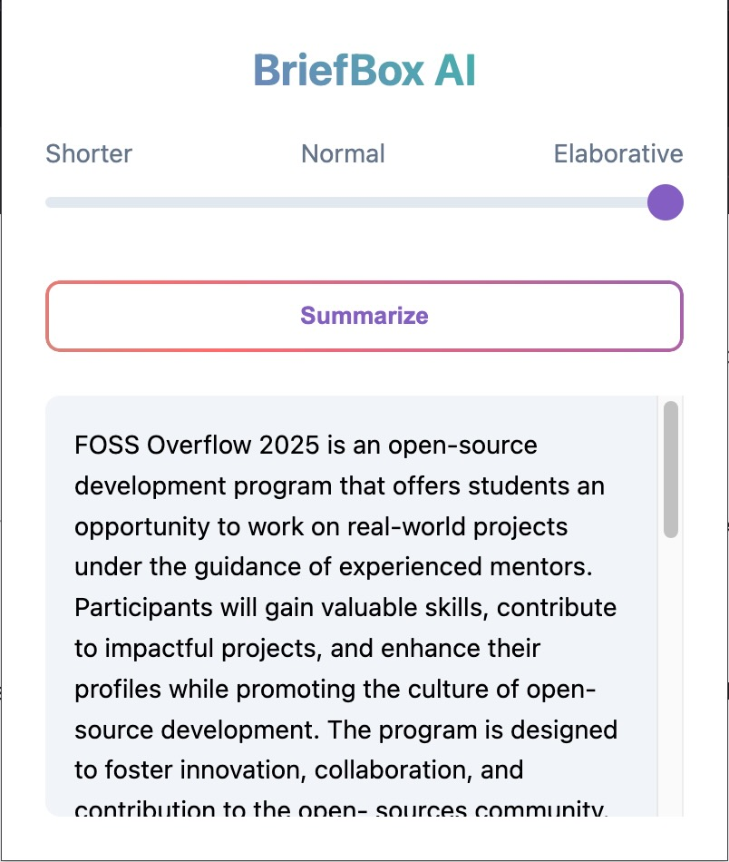

# BriefBox AI

BriefBox AI is a Chrome extension that helps users summarize email content with adjustable levels of detail. The extension provides a simple and intuitive interface for generating concise summaries of email threads, making it easier to quickly grasp the essential information.



## Features

- **Adjustable Summary Levels**: Choose between three summary modes:
  - Shorter: Quick, concise overview
  - Normal: Balanced summary with key details
  - Elaborative: Comprehensive summary with additional context

- **Simple Interface**: Clean, modern UI with an intuitive slider control
- **Real-time Processing**: Instant summarization of email content
- **Smooth Animations**: Polished user experience with gradient animations and typing effects
- **Gmail Integration**: Seamlessly works with Gmail interface

## API Integration

This extension uses a custom summarization API built specifically for this project. The API repository can be found at:
- [Summarizer API](https://github.com/ayushraj09/summarizer-api)

The API handles the text summarization functionality with support for different summary levels. It's deployed as a Cloud Function and processes the email content sent from the extension.

## Installation

1. Clone this repository:
```bash
git clone https://github.com/ayushraj09/brief-box-ai
```

2. Open Chrome and navigate to `chrome://extensions/`
3. Enable "Developer mode" in the top right corner
4. Click "Load unpacked" and select the cloned directory

## Usage

1. Open any email in Gmail
2. Click the BriefBox AI extension icon in your Chrome toolbar
3. Adjust the summary level using the slider (Shorter, Normal, or Elaborative)
4. Click the "Summarize" button
5. View your generated summary in the output box

## Technical Details

- **Frontend**: HTML, CSS, JavaScript
- **Backend**: Custom summarization API ([Repository](https://github.com/ayushraj09/summarizer-api))
- **API Deployment**: Google Cloud Functions
- **Chrome APIs**: Uses scripting and activeTab permissions
- **Styling**: Custom CSS with gradient effects and animations

## Project Structure

```
briefbox-ai/
├── manifest.json
├── popup.html
├── popup.js
├── styles.css
├── content.js
├── background.js
├── icon.png
└── README.md
```

## Dependencies

- Chrome Extension APIs
- [BriefBox Summarizer API](https://github.com/ayushraj09/summarizer-api)
- Gmail DOM integration

## Screenshots

### Different Summary Levels
<div style="display: flex; justify-content: space-between; align-items: center;">
  
  
  
</div>


## Development

To modify the extension:

1. Make changes to the source files
2. Reload the extension in `chrome://extensions/`
3. Test changes in Gmail

For API, please refer to the [API repository](https://github.com/ayushraj09/summarizer-api).

## License

MIT License

## Contributing

1. Fork the repository
2. Create your feature branch (`git checkout -b feature/AmazingFeature`)
3. Commit your changes (`git commit -m 'Add some AmazingFeature'`)
4. Push to the branch (`git push origin feature/AmazingFeature`)
5. Open a Pull Request

---
Made with ❤️ by Ayush
